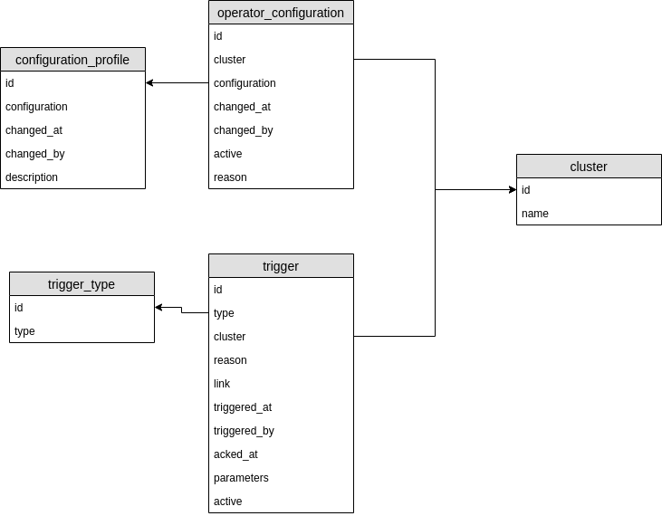

# Insights operator controller

[](https://goreportcard.com/report/github.com/RedHatInsights/insights-operator-controller) [](https://travis-ci.org/RedHatInsights/insights-operator-controller) [](https://codecov.io/gh/RedHatInsights/insights-operator-controller)

## Description

A service to be used to store Insights operator configuration and to offer the configuration to selected operator.

## How to build the tool

Use the standard Go command:

```
go build
```

This command should create an executable file named `insights-operator-controller`.

Alternatively you can use *GNU make* to perform the same operation:

```
make build
```


## Start

Just run the executable file created by `go build`:

```
./insights-operator-controller
```

If you need to start the cleanly built controller, use the following command:

```
make run
```


## Configuration

### HTTPS instead of HTTP

Change the following lines in `config.toml`:
```
use_https=true
address=":4443"
tls_cert="certs/cert.pem"
tls_key="certs/key.pem"
```

Please note that the service (when run locally) use the self-signed certificate.
You'd need to use `certs.pem` file on client side (curl, web browser etc.)

 - `use_https` is boolean flag that defines if connection should be secured
 - `address` is address of controller server
 - `tls_cert` is path to certificate, can be used only if `use_https == true`
 - `tls_key` is path to key of certificate, can be used only if `use_https == true`


### Configuration file

Default configuration file is `config.toml`. It is possible to specify config file via environment variable
named `INSIGHTS_CONTROLLER_CONFIG_FILE`. For example:

```
export INSIGHTS_CONTROLLER_CONFIG_FILE=~/config.toml
./insights-operator-controller
```

### Environment variables

 * `INSIGHTS_CONTROLLER_CONFIG_FILE` - custom path to config file (default: `./config.toml`)
 * `CONTROLLER_ENV` - specify environment (`development`, `test`, `production`. Default: `development`)
 * `CONTROLLER_PREFIX` - specify URL path prefix (Default: `/api/v1/`)

### LDAP Authentication

For authentication we using [Insights operator LDAP Auth](https://github.com/RedHatInsights/insights-operator-ldapauth) that are working as proxy between client and controller. For turning on authentication need set `export CONTROLLER_ENV=production`, by default for development and test purposes it turned off.

## Data storage

Data storage used by the service is configurable via the command line parameters. Currently it is possible to configure the following data storages:
* SQLite local database: `controller.db` for the local deployment and `test.db` for functional tests
* PostgreSQL database: for local deployment and to be able to deploy the application to developer development

## ER Diagram
[Insights operator database](https://drive.google.com/file/d/13dSJggeqBZT1khwSWdTPW4oGFZ8USM-V/view?usp=sharing)


### SQLite

Use the following scripts from the `local_storage` subdirectory to work with SQLite database:
* `create_database_sqlite.sh` to create new database stored in file `controller.db`
* `create_test_database_sqlite.sh` to create new database stored in file `test.db`, this database will be used by tests


### PostgreSQL

PostgreSQL needs to be setup correctly:
* User `postgres` should have password set to `postgres`
* In the configuration file `/var/lib/pgsql/data/pg_hba.conf`, the method `md5` needs to be selected for user `postgres` and `all`
* The PostgreSQL daemon (service) has to be started, of course: `sudo systemctl start postgresql`

For more information how to install PostgreSQL on Fedora (or RHEL) machine, please follow this guide:
https://computingforgeeks.com/how-to-install-postgresql-on-fedora/

Use the following scripts from the `local_storage` subdirectory to work with PostgreSQL database:
* `create_database_postgres.sh` to create new database named `controller`
* `create_test_database_postgres.sh` to create new database named `test_db`

The following two scripts can be used to drop existing database(s):
* `drop_database_postgres.sh` to drop database named `controller`
* `drop_test_database_postgres.sh` to drop database named `test_db`

---

You can also run PostgreSQL containerized with the prepared Dockerfile `local_storage/Dockerfile.postgres`
* there is a simple shortcut script `local_storage/dockerize_postgres.sh` which stops the container if it exists, then builds and runs a detached image.
* to automatically fill the database with test data, set an environment variable `MOCK_DATA=true` and [pass it to docker run](https://docs.docker.com/engine/reference/commandline/run/#set-environment-variables--e---env---env-file)
* the environment variables from the [original postgres image](https://hub.docker.com/_/postgres), such as `PGDATA` also work

### RDS AWS PostgreSQL

To set up a database on RDS AWS, an AWS account is needed. To set up the AWS account follow instructions:
https://aws.amazon.com/premiumsupport/knowledge-center/create-and-activate-aws-account/

After AWS account is set up, follow instructions to set up a PostreSQL database instance here : https://docs.aws.amazon.com/AmazonRDS/latest/UserGuide/USER_CreatePostgreSQLInstance.html
Set up the database instance as needed. 
Set the name of the database as `postgres`. (Not the DB instance identifier.) 

When database instance status becomes available, set environment variables `$RDS_MASTERUSER`, `$RDS_MASTERPASSWORD` and `$RDS_ENDPOINT` with values 
`master username`, `master password`, and `endpoint` including `port`, of your database instance.
Run `create_RDS_database_postgres.sh` to create database.

To drop previously created database, run `drop_RDS_database_postgres.sh`.

 
## Testing

### Unit tests

The following command runs all unit tests against newly built controller:

```
make test
```

In case you just need to start unit tests without the clean+build step, use following command:

```
go test ./...
```

It is also possible to increase verbosity level:

```
go test -v ./...
```

### REST API tests

REST API tests need the running service and the test database to be prepared. In order to
perform REST API tests, start the following script:

```
./test.sh
```

Please note that the service should not be running at the same moment (as it used the same port).

## Code style and cyclomatic complexity checks

All code style checks, cyclomatic complexity measurement etc. can be started from command line by using:

```
make style
```

## CI

[Travis CI](https://travis-ci.com/) is configured for this repository. Several tests and checks are started for all pull requests:

* Unit tests that use the standard tool `go test`
* `go fmt` tool to check code formatting. That tool is run with `-s` flag to perform [following transformations](https://golang.org/cmd/gofmt/#hdr-The_simplify_command)
* `go vet` to report likely mistakes in source code, for example suspicious constructs, such as Printf calls whose arguments do not align with the format string.
* `golint` as a linter for all Go sources stored in this repository
* `gocyclo` to report all functions and methods with too high cyclomatic complexity. The cyclomatic complexity of a function is calculated according to the following rules: 1 is the base complexity of a function +1 for each 'if', 'for', 'case', '&&' or '||' Go Report Card warns on functions with cyclomatic complexity > 9
* `gosec` to inspect source code for security problems by scanning the Go AST
* `ineffassign` to detect and print all ineffectual assignments in Go code
* `errcheck` for checking for all unchecked errors in go programs
* `shellcheck` to perform static analysis for all shell scripts used in this repository
* `abcgo` to measure ABC metrics for Go source code and check if the metrics does not exceed specified threshold

History of checks done by CI is available at [RedHatInsights / insights-operator-controller](https://travis-ci.org/RedHatInsights/insights-operator-controller).

## Contribution

Please look into document [CONTRIBUTING.md](CONTRIBUTING.md) that contains all information about how to contribute to this project.
